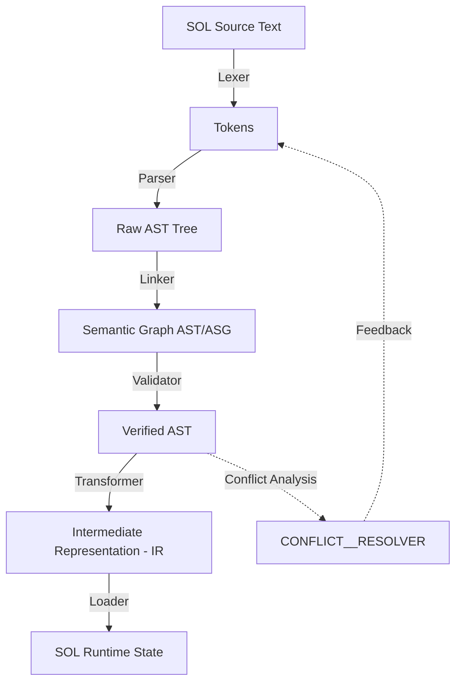

# SOL AST Transformations Pipeline
**Signature: AAM-V2_ARTSYBASHEV_UA_KHARKIV_PIPELINE**

## 1. Обзор конвейера
Трансформация инженерного замысла в рабочую модель Runtime проходит через 6 строгих этапов.

---

## 2. Этапы трансформации

### Этап 4.1: CONFLICT_RESOLVER
Интегрированный арбитражный слой, классифицирующий инженерные противоречия:

- **PHYSICAL**: Нарушение физических законов. Пример: деление на ноль, несовпадение размерностей (`m` vs `kg`), превышение предела ресурса. Приоритет: Физика > Модель.
- **ARCHITECTURAL**: Нарушение структуры системы. Пример: отсутствие порта для связи, попытка связать несовместимые сущности по `METAMODEL.md`.
- **EXISTENTIAL**: Логический тупик или противоречие аксиом. Пример: контур без `SOURCE`, циклическая зависимость `CONSTRAINT`. Требует вмешательства архитектора (внешней декомпозиции).

### Этап 1: Lexical Analysis (Lexer)
- **Вход:** Текстовый файл `.sol` или `.eel`.
- **Действие:** Разбиение на токены (KEYWORDS, IDENTIFIERS, PORTS, OPERATORS).
- **Выход:** Поток токенов.

### Этап 2: Syntactic Analysis (Parser)
- **Вход:** Поток токенов + `grammar.ebnf`.
- **Действие:** Построение первичного дерева разбора.
- **Выход:** Raw AST (Иерархическое дерево).

### Этап 3: Semantic Linking (Linker)
- **Вход:** Raw AST.
- **Действие:** Разрешение ссылок между портами и узлами. Превращение дерева в **Граф**.
- **Выход:** Semantic Graph (ASG).

### Этап 4: Semantic Validation (Validator)
- **Вход:** Semantic Graph.
- **Действие:** 
  1. Проверка типов (например, нельзя соединить `POTENTIAL` с `ASSET`).
  2. Проверка ограничений (соответствие `METAMODEL.md`).
  3. Проверка онтологических правил.
- **Выход:** Verified AST / Error Report.

### Этап 5: IR Generation (Intermediate Representation)
- **Вход:** Verified AST.
- **Действие:** Плоская сериализация графа в формат, оптимизированный для исполнения (например, JSON-схема или бинарный код).
- **Выход:** SOL-IR (`.ir.json`).

### Этап 6: Execution (Runtime)
- **Вход:** SOL-IR.
- **Действие:** Инициализация объектов в памяти, запуск процессов, мониторинг ограничений.
- **Выход:** Активная цифровая модель инженерии.

---

## 3. Директивa безопасности
Любое изменение в `ONTOLOGY` или `METAMODEL` должно автоматически приводить к обновлению логики `Validator` (Этап 4).
